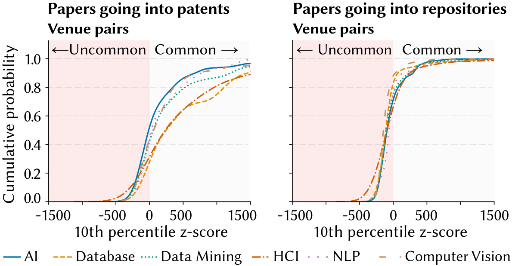

# 📊 Measuring the Translational Impact of Computer Science Research

## 🧠 Abstract

This repository supports the paper **_Measuring How Computer Science Research Translates into Innovation and Development_** by Federico Cinus, Ali Septiandri, Marios Constantinides, Daniele Quercia. The paper quantifies how scientific research in computer science translates into **patents** and **software repositories**, moving beyond traditional citation metrics to study the *real-world technological uptake* of research. Through large-scale data analysis of 200,000 papers from top-tier CS venues, the study uncovers the timing, topics, institutions, and novelty factors that drive translational impact.

Ack: The study was undertaken as part of Federico’s internship at Nokia Bell Labs, Cambridge, UK.

---

## 📚 Cite Us

If you use our code or data, please cite:

```bibtex
@article{cinus2025measuring,
  title={Measuring how computer science research translates into innovation and development},
  author={Cinus, Federico and Septiandri, Ali and Constantinides, Marios and Quercia, Daniele},
  journal={EPJ Data Science},
  volume={14},
  number={1},
  pages={51},
  year={2025},
  publisher={Springer}
}
```

---

## 🛠️ Approach

Our methodology builds a bridge between academic research and its real-world influence through patents and GitHub repositories. It includes:

1. **Large-Scale Data Collection:**  
   - ~200K papers from AI, NLP, HCI, CV, DB, and DM (1980–2022), U.S. patents from USPTO, GitHub repos from PapersWithCode  

2. **Impact Matching:**  
   - Paper ↔ Patent citations using GROBID and Sentence-T5  
   - Paper ↔ Repo linkage from PapersWithCode  

3. **Metrics Defined:**  
   - Patent and repo impact proportions  
   - Survival analysis for *time-to-impact*  
   - Topic modeling via LDA  
   - Institutional analysis  
   - Citation conventionality via venue pairwise z-scores

<p align="center">
  
</p>

> **Figure Suggestion:** *Figure 2* — use the Kaplan-Meier plot to visualize the difference in time-to-impact between patents and repositories.

---

## 💡 Key Findings

- **Disproportionate Influence:**  
  A small subset of papers (e.g., 5.9% in AI) accounts for up to 43% of citations and real-world uptake.

- **Asymmetric Timelines:**  
  - Papers → Patents: Lag of 10–30 years  
  - Papers → Repositories: Peak uptake within the first year

- **Topic Trends:**  
  - Deep learning, Graph-based learning, and Data-centric AI dominate translational impact.

- **Conventionality Matters:**  
  - **Patents** prefer *conventional knowledge* combinations.  
  - **Repositories** favor *unconventional pairings*.

- **Institutional Insights:**  
  Google, Microsoft, Stanford, MIT, and Tencent are leaders in producing highly impactful papers.

<p align="center">
  
</p>

> **Figure Suggestion:** *Figure 5* — highlights how conventionality predicts different kinds of real-world impact.

---

## 📈 Trends

<p align="center">
  
</p>

> **Figure Suggestion:** *Figure 4* — shows the rising influence of AI and NLP papers over time on patents and repositories.

---

## 📁 Data

### 📦 Reproducibility Dataset

Download the reproducibility dataset from the following link:  
**[📥 Placeholder for download link]**

Place the extracted data folder in the **root directory** of the repository. The structure should look like this:

```
research-impact/
├── code/
├── data/                ← place downloaded data here
│   ├── *.parquet
├── figures/
├── tables/
├── environment.yml
└── README.md
```

This dataset includes only the subset of papers directly analyzed in the study. It contains all enrichments, processed metrics, and cleaned fields necessary to reproduce the results.

---

### 📚 Broader Dataset

Download the broader dataset from the following link:  
**[📥 Broader Dataset on Google Drive](https://drive.google.com/file/d/1-sR5sNewhDH-TlzCWT961m2s-4fM6z2m/view?usp=sharing)**


This dataset contains metadata for a wide range of computer science papers, including both those analyzed in the study and others included for completeness. Each row represents a unique paper (`corpusid`) and is enriched, where available, with metadata derived from GitHub, patent citations, institutional affiliations, and co-citation novelty analysis. Many of these enrichment fields are partially populated, reflecting limited availability for papers not included in the core study.

#### 📄 Column Descriptions

- **corpusid**: Unique identifier for the paper.  
- **DOI**: Digital Object Identifier.  
- **title**: Title of the paper.  
- **venue**: Publication venue (conference or journal).  
- **year**: Year of publication.  
- **citationcount**: Total number of academic citations received.  
- **stars**: Number of GitHub stars (for papers with linked repositories).  
- **forks**: Number of GitHub forks.  
- **patent_citationcount**: Number of times the paper is cited in patents.  
- **venue_code**: Abbreviated venue code (e.g., “CVPR”, “ICML”).  
- **venue_area**: Research area the venue belongs to (e.g., “Computer Vision”).  
- **is_top_5**: Whether the venue is among the top 5 in its research area.  
- **year_min_development**: Earliest year the paper was cited in a patent (proxy for technological development).  
- **year_min_innovation**: Earliest year the paper was reused in GitHub code (proxy for software innovation).  
- **atypical_median**: Median z-score of citation atypicality based on co-citation novelty.  
- **atypical_10percentile**: 10th percentile of atypicality z-scores, capturing early or extreme novelty.  
- **institutions**: List of author affiliations.  
- **abstract**: Paper abstract (if available).  

#### 🧪 Missing Data Notes

Because this dataset includes general CS papers beyond those analyzed, some enrichment fields are sparsely populated: **stars**, **forks**, **patent_citationcount**, **year_min_development**, **year_min_innovation**, **atypical_median**, **atypical_10percentile**, **abstract**.


---

## 🔧 Requirements

All requirements are listed in `environment.yml`. Create the environment with:

```bash
conda env create -f environment.yml
conda activate csimpact
```

### 📓 Use the environment in Jupyter Notebook

After activating the environment, install the IPython kernel:

```bash
python -m ipykernel install --user --name=csimpact --display-name "Python (csimpact)"
```

Then you can select **"Python (csimpact)"** as the kernel inside your Jupyter notebooks.

✅ Tip: If you don't have Jupyter installed, you can add it with:
```bash
conda install notebook
```

---

## ▶️ Usage

- **Analysis notebooks** (`1-*.ipynb` to `5-*.ipynb`) reproduce each figure and table in the paper. The `data/` folder contains all the processed files needed to run the analysis. 
  Each notebook includes markdown cells referencing the corresponding **figure or table** by number (e.g., *Fig. 1*, *Table 1*).


---

## 📊 Notebooks Overview

Each notebook corresponds to one or more figures or tables in the paper. The notebook filenames follow the pattern X-*.ipynb, where X indicates the order in which the analysis appears in the paper.

#### `1-academic-citations.ipynb`
Produces statistics on academic impact and computes the proportion of papers that lead to patents or software repositories. Supports **Table 2**, and **Figure 1**.

#### `2.0-time-survival.ipynb`
Performs survival analysis to estimate how long it takes for papers to generate technological outputs (patents/repos). Supports **Figure 2**.

#### `2.1-time-lineplot.ipynb`
Plots yearly trends of publications and technological uptake across research domains. Supports **Figure 3**.

#### `3-institutions.ipynb`
Analyzes institutional affiliations of impactful research (academic vs. corporate), and their link to technology creation. Supports **Table 3**.

#### `4-topics.ipynb`
Analyzes the topical composition of successful papers and visualizes how the prevalence of each topic evolves over time. Supports **Figure 4**.

#### `5-conventionality.ipynb`
Examines the role of conventionality (via atypical venue pairs) in determining success in tech transfer. Supports **Figure 5**.
